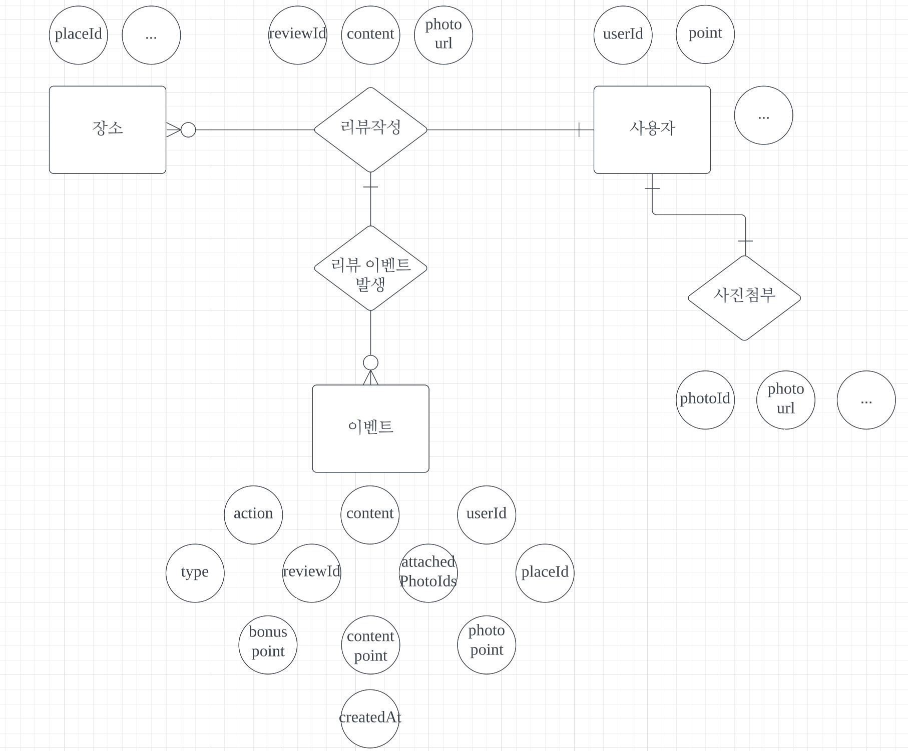
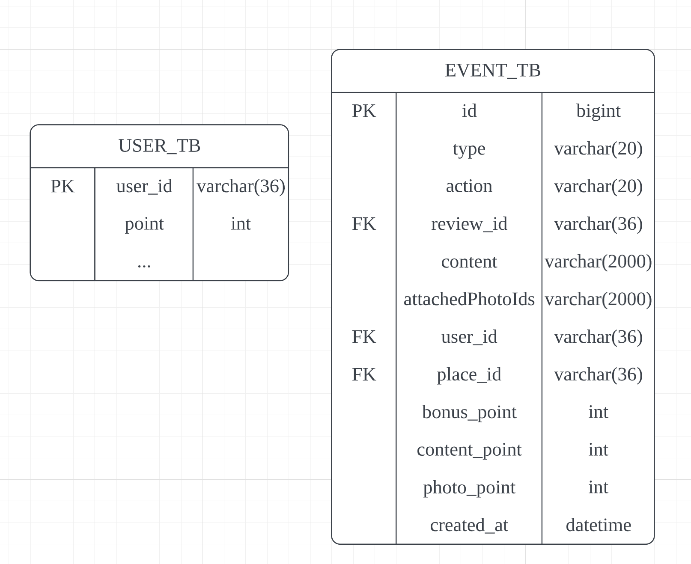

# triple-api

트리플여행자 클럽 마일리지 서비스 api 구현

## DB

Mybatis + MySQL 연동

~~~xml
spring.datasource.url=jdbc:mysql://127.0.0.1:3306/mileage
spring.datasource.username=triple
spring.datasource.password=12345678
~~~

**DB 개념적 설계**

전체적인 프로세서 구상
API 작성시 필요한 DB는 사용자테이블, 리뷰이벤트테이블, 
리뷰테이블**(이미 만들어진 리뷰테이블 사용할 예정이지만, 직관적으로 테스트하기위해 간단한 리뷰테이블 생성)**

* 이벤트DB 구성을 작성

| 컬럼             | 내용                                                         |
| ---------------- | ------------------------------------------------------------ |
| id               | auto increment되는 PK가 필요                                 |
| type             | 어떤 이벤트인지 파악하는 컬럼                                |
| action           | 리뷰가 새로 작성이 되었는지, 수정이 되었는지, 삭제가 되엇는지 파악하는 컬럼 |
| reviewId         | 작성된 리뷰의 PK                                             |
| content          | 작성된 리뷰의 내용                                           |
| attachedPhotoIds | 사진 테이블에서 사진 URL을 가져오기 위한 사진 테이블의 PK    |
| userId           | 작성한 유저의 PK                                             |
| placeId          | 작성된 장소의 PK                                             |
| created_at       | 발생된 이벤트 시간                                           |

**DB 논리적 설계**

리뷰 이벤트 릴레이션

| <u>id</u> | type | action | review_id | content | attachedPhotoIds | user_id | place_id |
| --------- | ---- | ------ | --------- | ------- | ---------------- | ------- | -------- |

유저 릴레이션

| <u>user_id</u> | point | ...  |
| -------------- | ----- | ---- |

**DDL 작성**

~~~sql
DROP TABLE IF EXISTS EVENT_TB CASCADE;
DROP TABLE IF EXISTS REVIEW_TB CASCADE;
DROP TABLE IF EXISTS USER_TB CASCADE;

#USER_TB
CREATE TABLE USER_TB (
	user_id VARCHAR(36) PRIMARY KEY,
  point int NOT NULL DEFAULT 0
);
#EVENT_TB
CREATE TABLE EVENT_TB (
  id bigint primary key auto_increment,
  type varchar(20) NOT NULL,
  action varchar(20) NOT NULL,
	review_id VARCHAR(36) NOT NULL,
  content VARCHAR(2000) NOT NULL,
  photo_url VARCHAR(2000),
  user_id VARCHAR(36) NOT NULL,
  place_id VARCHAR(36) NOT NULL,
  bonus_point int NOT NULL DEFAULT 0,
  content_point int NOT NULL DEFAULT 0,
  photo_point int NOT NULL DEFAULT 0,
  createdAt datetime NOT NULL DEFAULT NOW()
);

#REVIEW_TB
CREATE TABLE REVIEW_TB (
	review_id varchar(36) primary key,
  user_id varchar(36) not null,
  place_id varchar(36) not null,
  status_code int not null default 1
);

#index
CREATE INDEX IDX_EVENT_01 ON EVENT_TB(createdAt);
CREATE INDEX IDX_EVENT_02 ON EVENT_TB(type, user_id, place_id);
CREATE INDEX IDX_EVENT_03 ON EVENT_TB(user_id, review_id);
CREATE INDEX IDX_REVIEW_01 ON REVIEW_TB(user_id, place_id);

#Foreign Key
ALTER TABLE EVENT_TB ADD CONSTRAINT EVENT_USER_ID_FK FOREIGN KEY (user_id) REFERENCES USER_TB (user_id) ON DELETE CASCADE ON UPDATE CASCADE;
ALTER TABLE EVENT_TB ADD CONSTRAINT EVENT_REVIEW_ID_FK FOREIGN KEY (review_id) REFERENCES REVIEW_TB (review_id) ON DELETE CASCADE ON UPDATE CASCADE;
ALTER TABLE REVIEW_TB ADD CONSTRAINT REVIEW_USER_ID_FK FOREIGN KEY (user_id) REFERENCES USER_TB (user_id) ON DELETE CASCADE ON UPDATE CASCADE;
#ALTER TABLE EVENT_TB ADD CONSTRAINT EVENT_PLACE_ID_FK FOREIGN KEY (place_id) REFERENCES PLACE_TB (place_id) ON DELETE CASCADE ON UPDATE CASCADE;
~~~

## 로직 설계

ADD

* ADD에는 리뷰 테이블이 따로 필요하다. 최초로 판단하는 것을 이벤트에서 확인하는 것보다 리뷰 테이블에서 place_id에 해당하는 리뷰가 있는지 조회하는 것이 빠르다고 판단하였다.

1. 리뷰 테이블에 (요청받은 장소아이디 데이터) 조회
   * 조회되는 리뷰가 없다면 최초 리뷰로 판단 bonus_point 1점
   * 조회되는 리뷰가 있다면 최초 리뷰가 아님 bonus_point 0점
2. content는 not null로 설정 content_point 1점
3. photo는 attachedPhotoIds가 null인지 확인
   * null이면 photo가 없다. photo_point 0점
   * null이 아니면 photo가 있다. photo_point 1점

MOD

1. 이 유저의 가장 최근 이벤트 발생 조회
2. 최초 리뷰 포인트와 content_point는 그대로
3. photo_point가 0이라면 attachedPhotoIds가 null이 아니라면 photo_point 1로 변경
4. photo_point가 1이라면 attachedPhotoIds가 null이라면 photo_point 0으로 변경

DELETE

1. 이 유저의 가장 최근 이벤트 발생 조회
2. (bonus_point + content_point + photo_point)를 유저 point에서 뺀다.

~~~sql
#최근 이벤트 조회 쿼리
select * from event_tb e1
left join (
select max(createdAt) max
from event_tb
where type = "REVIEW" and user_id = "test user2" and place_id = "test place"
) e2 on max = e1.createdAt
where max is not null;
~~~

## TEST

1. ADD시 없는 유저를 이벤트로 받으면 validation 되는지 확인
2. 없는 리뷰를 이벤트로 받으면 validation 되는지 확인
3. 유저도 있고 리뷰도 있지만 서로 맞지 않을 때 validation 되는지 확인
4. 최초리뷰시 보너스 점수 받는지 확인
5. 유저2가 리뷰를 추가하고 유저1이 두번 째 리뷰시 보너스 점수 받지 않는지 확인
6. 유저2가 리뷰를 추가하고 삭제한 후에 유저1이 리뷰 작성하면 최초리뷰 보너스 받는지 확인
7. 유저2가 리뷰를 추가하고 유저1이 리뷰 추가한 후에 유저2가 리뷰 삭제하면 최초리뷰 보너스 유저1이 받지 않는지 확인
8. 유저1이 포토 보너스 받은 후에 포토 지우면 포토 점수 회수하는지 확인
9. 유저2가 포토없다가 포토 추가하면 점수 받는지 확인
