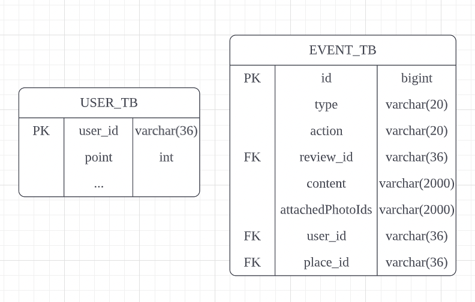

# triple-api

트리플여행자 클럽 마일리지 서비스 api 구현

## DB

Mybatis + MySQL 연동

~~~xml
spring.datasource.url=jdbc:mysql://127.0.0.1:3306/mileage
spring.datasource.username=triple
spring.datasource.password=12345678
~~~

**DB 개념적 설계**

전체적인 프로세서 구상
API 작성시 필요한 DB는 사용자DB, 리뷰이벤트DB

* 이벤트DB 구성을 작성

|                  |                                                              |      |
| ---------------- | ------------------------------------------------------------ | ---- |
| id               | auto increment되는 PK가 필요                                 |      |
| type             | 어떤 이벤트인지 파악하는 컬럼                                |      |
| action           | 리뷰가 새로 작성이 되었는지, 수정이 되었는지, 삭제가 되엇는지 파악하는 컬럼 |      |
| reviewId         | 작성된 리뷰의 PK                                             |      |
| content          | 작성된 리뷰의 내용                                           |      |
| attachedPhotoIds | 사진 테이블에서 사진 URL을 가져오기 위한 사진 테이블의 PK    |      |
| userId           | 작성한 유저의 PK                                             |      |
| placeId          | 작성된 장소의 PK                                             |      |

**DB 논리적 설계**

리뷰 이벤트 릴레이션

| <u>id</u> | type | action | review_id | content | attachedPhotoIds | user_id | place_id |
| --------- | ---- | ------ | --------- | ------- | ---------------- | ------- | -------- |

유저 릴레이션

| <u>user_id</u> | point | ...  |
| -------------- | ----- | ---- |

**DDL 작성**

~~~sql
DROP TABLE IF EXISTS EVENT_TB CASCADE;
DROP TABLE IF EXISTS USER_TB CASCADE;

#USER_TB
CREATE TABLE USER_TB (
	user_id VARCHAR(36) PRIMARY KEY,
  point int NOT NULL DEFAULT 0
);
#REVIEW_TB
CREATE TABLE EVENT_TB (
  id bigint primary key auto_increment,
  type varchar(20) NOT NULL,
  action varchar(20) NOT NULL,
	review_id VARCHAR(36) NOT NULL,
  content VARCHAR(2000) NOT NULL,
  photo_url VARCHAR(2000),
  user_id VARCHAR(36) NOT NULL,
  place_id VARCHAR(36) NOT NULL
);

#index
CREATE INDEX IDX_EVENT01 ON EVENT_TB(type, user_id, place_id);

#Foreign Key
ALTER TABLE EVENT_TB ADD CONSTRAINT EVENT_USER_ID_FK FOREIGN KEY (user_id) REFERENCES USER_TB (user_id) ON DELETE CASCADE ON UPDATE CASCADE;
#ALTER TABLE EVENT_TB ADD CONSTRAINT EVENT_USER_ID_FK FOREIGN KEY (review_id) REFERENCES REVIEW_TB (review_id) ON DELETE CASCADE ON UPDATE CASCADE;
#ALTER TABLE EVENT_TB ADD CONSTRAINT EVENT_PLACE_ID_FK FOREIGN KEY (place_id) REFERENCES PLACE_TB (place_id) ON DELETE CASCADE ON UPDATE CASCADE;
~~~

