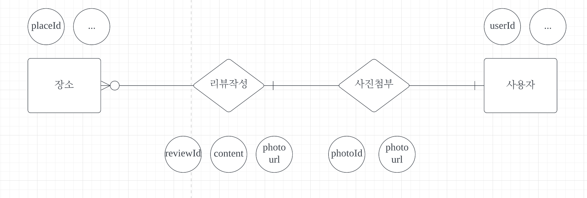
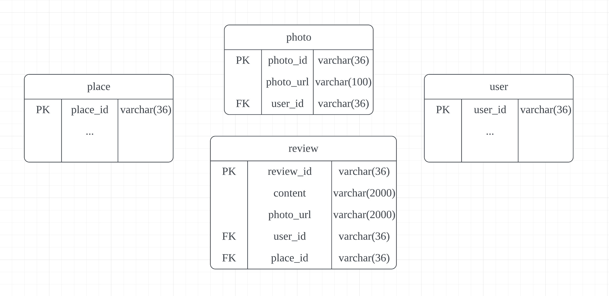

# triple-api

트리플여행자 클럽 마일리지 서비스 api 구현

## DB

Mybatis + MySQL 연동

~~~xml
spring.datasource.url=jdbc:mysql://127.0.0.1:3306/mileage
spring.datasource.username=triple
spring.datasource.password=12345678
~~~

**DB 개념적 설계**

**DB 논리적 설계**

장소 릴레이션

| <u>place_id</u> | ...  | ...  |
| --------------- | ---- | ---- |

유저 릴레이션

| <u>user_id</u> | ...  | ...  |
| -------------- | ---- | ---- |

리뷰작성 릴레이션

| <u>review_id</u> | content | photo_url | user_id | place_id |
| ---------------- | ------- | --------- | ------- | -------- |

이미지 릴레이션

| <u>photo_id</u> | user_id | photo_url |
| --------------- | ------- | --------- |

**DDL 작성**

~~~sql
#PLACE_TB
CREATE TABLE PLACE_TB (
  place_id VARCHAR(36) NOT NULL
);
#USER_TB
CREATE TABLE USER_TB (
	user_id VARCHAR(36) NOT NULL
);
#REVIEW_TB
CREATE TABLE REVIEW_TB (
	review_id VARCHAR(36) NOT NULL,
  content VARCHAR(2000) NOT NULL,
  photo_url VARCHAR(2000),
  user_id VARCHAR(36) NOT NULL,
  place_id VARCHAR(36) NOT NULL
);
#PHOTO_TB
CREATE TABLE PHOTO_TB (
	photo_id VARCHAR(36) NOT NULL,
  photo_url VARCHAR(100) NOT NULL,
  user_id VARHCAR(36) NOT NULL
)

#Primary Key
ALTER TABLE PLACE_TB ADD CONSTRAINT PLACE_PK PRIMARY KEY(place_id);
ALTER TABLE USER_TB ADD CONSTRAINT USER_PK PRIMARY KEY(user_id);
ALTER TABLE REVIEW_TB ADD CONSTRAINT REVIEW_PK PRIMARY KEY(review_id);
ALTER TABLE PHOTO_TB ADD CONSTRAINT PHOTO_PK PRIMARY KEY(photo_id);

#Foreign Key
ALTER TABLE REVIEW_TB ADD CONSTRAINT REVIEW_USER_ID_FK FOREIGN KEY (user_id) REFERENCES USER_TB (user_id) ON DELETE CASCADE ON UPDATE CASCADE;
ALTER TABLE REVIEW_TB ADD CONSTRAINT REVIEW_PLACE_ID_FK FOREIGN KEY (place_id) REFERENCES PLACE_TB (place_id) ON DELETE CASCADE ON UPDATE CASCADE;
ALTER TABLE PHOTO_TB ADD CONSTRAINT PHOTO_USER_ID_FK FOREIGN KEY (user_id) REFERENCES USER_TB (user_id) ON DELETE CASCADE ON UPDATE CASCADE;
~~~

